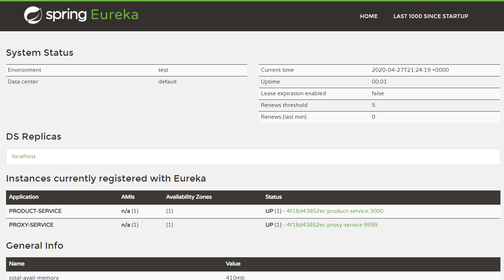

# Microservices with SpringBoot
This academic project was made in the context of a practical work about Software Architecture.

## Services
This project contains several services:
1. Product Service: Business service
2. Config Service: The single source of configuration for all microservices
3. Proxy Service: Responsible for the routing of requests and load balancing
4. Discovery Service: A global registry where are all microservices are registered, enabling easy discovery and decoupling.

## Screenshot of the service on Eureka

## With the proxy service

## With two instances of the service "ProductService"

## Credits
All the credits goes to Houssem Ben Braiek et Hadhemi Jabnoun, two students at INSAT And Ms. Lilia Sfaxi, a professor at INSAT, who rewrote this detailed [tutorial](https://insatunisia.github.io/TP-eServices/tp4/) from which this work was inspired.